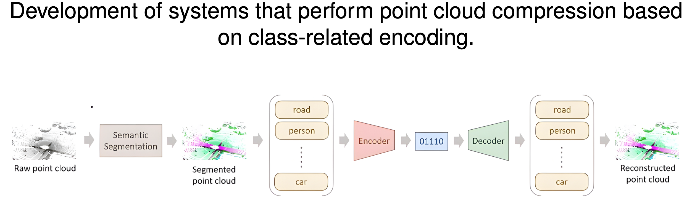
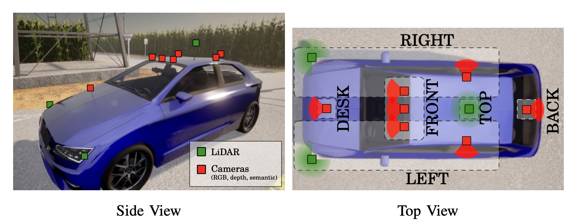
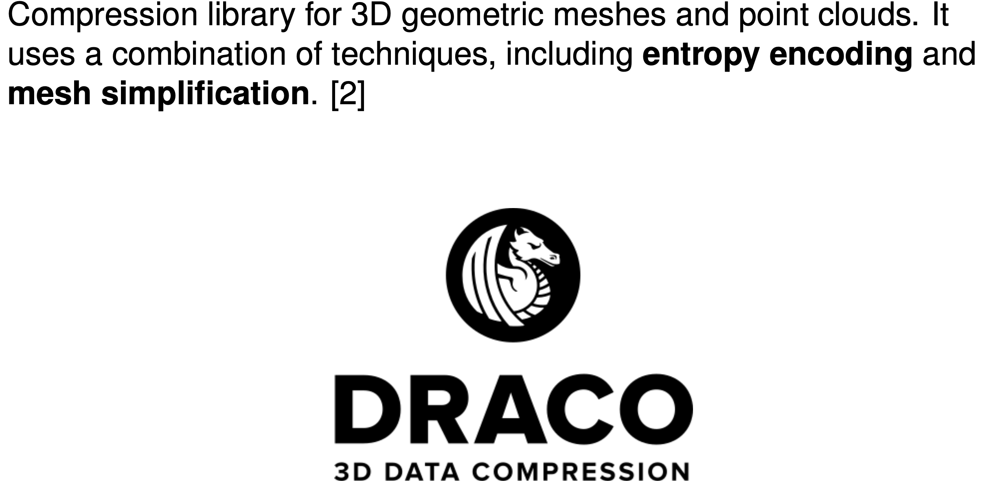
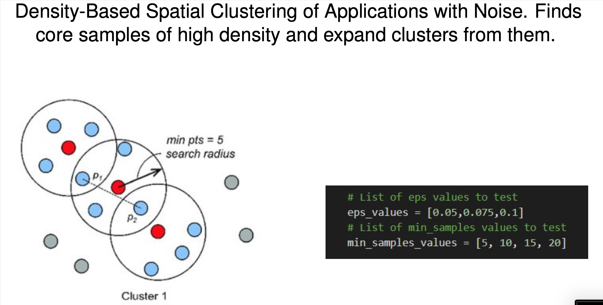
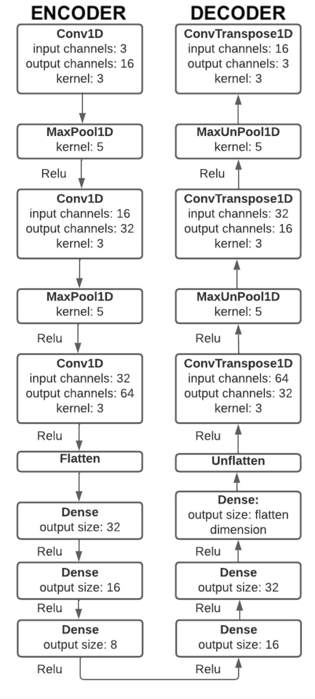
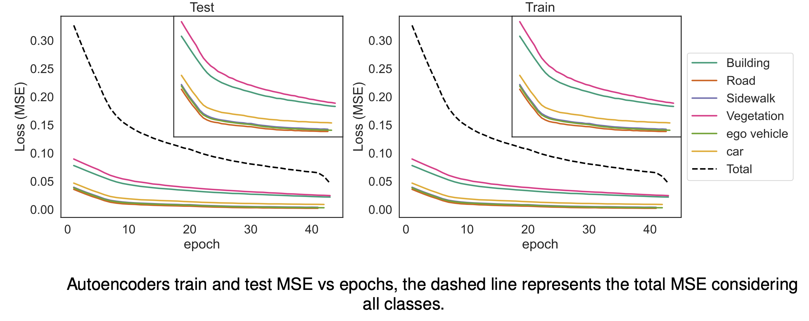
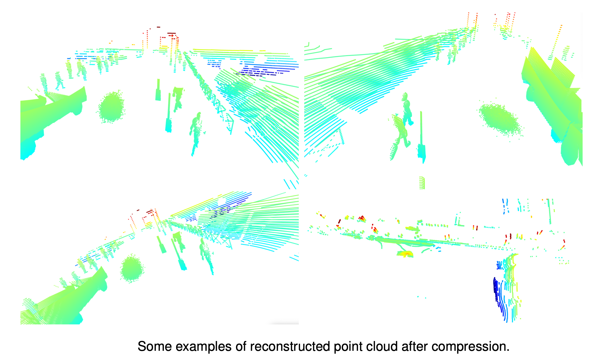
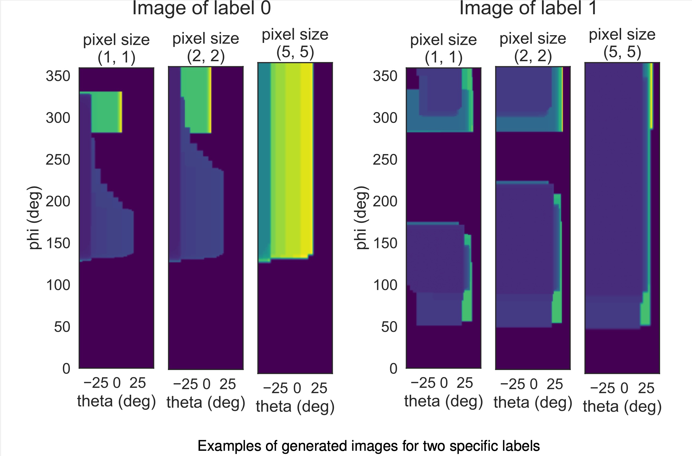
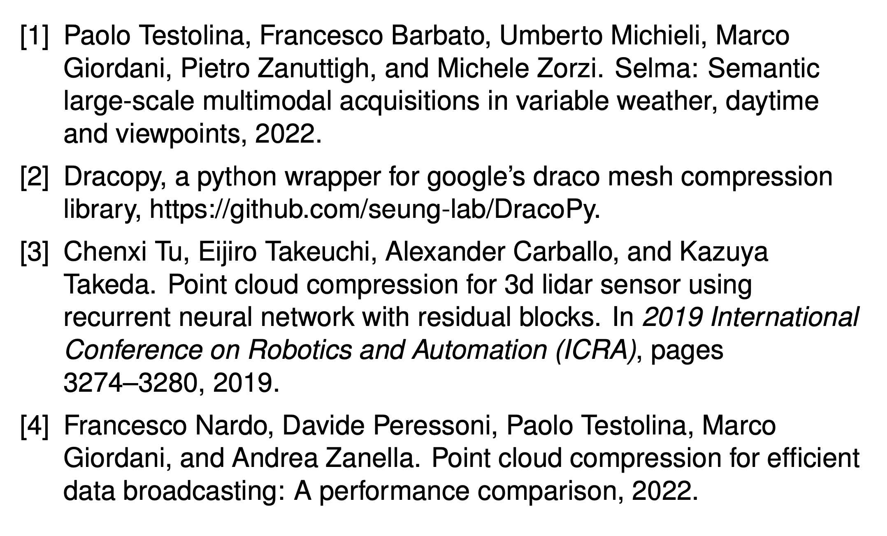

# PointCloudCompression
 
This project aims to provide an implementation of Point Cloud Compression (PCC) methods for segmented point clouds. 

Developed together with Saverio Cavasin (@SvrCvs)
## Task 

  

## Dataset
The dataset is the [SELMA](https://scanlab.dei.unipd.it/selma-dataset/) dataset, which is made by data collected by of 3 LIDARs located on a vehicle in a urban scenario. 
The location of the sensors is the following:

  

An example of the dataset is shown in the figure below:

  

The point clouds are segmented in different clsses, widely discussed [here](https://scanlab.dei.unipd.it/selma-dataset/).

## Strategies 
### 1) **DRACO** [2] 
is a compression library for 3D geometric meshes and point clouds. It is based on the Google Draco library, which is a general-purpose 3D geometry compression library.

  

### 2) **DBScan** 
is a density-based clustering algorithm. It is a popular algorithm for clustering in a spatial context. The algorithm groups together points that are closely packed together (points with many nearby neighbors), marking as outliers points that lie alone in low-density regions (whose nearest neighbors are too far away).

  

### 3) **Convolutional Autoencoder**
trained to learn a representation (encoding) of a sample, with the lower possible loss in the reconstruction of the input data. 
The network is composed by an encoder and a decoder. The encoder compresses the input data into a lower dimensional space, while the decoder reconstructs the input data from the compressed representation. The architecture of the network is the following:

  

The training is done on 400 Point clouds  of each class, and the test is done on 100 point clouds of each class. The results are the following:

  

Some examples of the reconstruction are the following:

  

### 4) **2D Projection** [3][4]
Finally, we propose to change the coordinate system of the point cloud from cartesian to spherical and then project the point cloud on a 2D plane, whith a specific grid size. Some examples are the following:

  

### References

  

